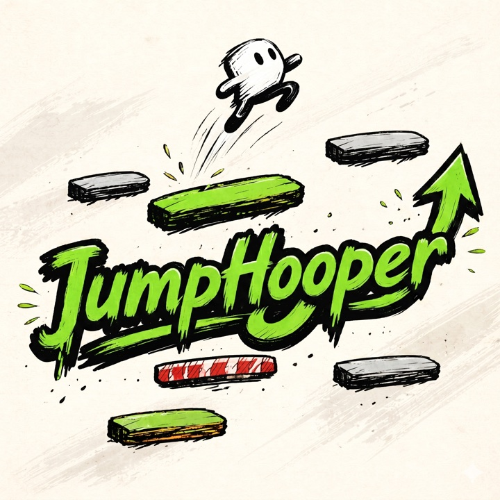

<div align="center">



# JumpHooper

**Bounce. Climb. Don't look down.**

An endless vertical platformer in the spirit of Doodle Jump — built from scratch in **Java + libGDX** as the final project for the *Design Pattern Class*.

[](https://openjdk.org/projects/jdk/17/)
[](https://libgdx.com/)
[](https://gradle.org/)
[](#)
[](#license)

</div>

---

## The game in 30 seconds

Steer a chunky ink-doodled character as it auto-jumps from platform to platform, higher and higher forever. Miss a platform, tumble off-screen, game over. Beat your own high score — that's the whole loop.

| 🟢 Green | 🔴 Red | 🔵 Blue | ⚪ White |
|:---:|:---:|:---:|:---:|
| Standard bounce | One-hit, then breaks | Slides side-to-side | Vanishes on contact |

---

## Quick start

```bash
# Desktop (primary target)
./gradlew desktop:run

# Android (optional)
./gradlew android:installDebug android:run

# Tests
./gradlew test

# Sanity compile without launching
./gradlew compileJava
```

Requirements: **JDK 17**. The Gradle wrapper handles everything else.

---

## Controls

| Action | Desktop | Android |
|---|---|---|
| Move left | `←` / `A` | Tilt left |
| Move right | `→` / `D` | Tilt right |
| Jump | *automatic on platform contact* | *automatic on platform contact* |
| Pause | `Esc` | Back button |

---

## Why this repo exists — the six design patterns

Grade weight isn't on gameplay polish — it's on **how clearly six classical patterns show up in the code**. Every pattern lives in a named class a reader can point at.

| Pattern | Home | What it does |
|---|---|---|
| **Singleton** | `managers/ScoreManager` | One shared score source, `Preferences`-backed high score |
| **Factory Method** | `factories/PlatformFactory.create(type, x, y)` | Builds platform subtypes without a `switch` leaking into `GameScreen` |
| **Strategy** | `Platform.onContact(Doodle)` overrides | Each platform type defines its own reaction (bounce / break / slide / vanish) |
| **Observer** | `events/EventBus` + `events/ContactListener` | HUD, audio, score all subscribe to contact + death events |
| **State** | `state/GameState` → `Playing` / `Paused` / `GameOver` | Clean transitions instead of boolean flags |
| **Adapter** | `input/InputController` → `Keyboard` / `Accelerometer` | Unifies two very different input APIs behind one interface |

See [`docs/ARCHITECTURE.md`](docs/ARCHITECTURE.md) for the full deep-dive with sequence diagrams.

---

## Tech stack

| Area | Choice |
|---|---|
| Language | **Java 17** |
| Engine | **libGDX 1.12.1** |
| Build | Gradle (wrapper committed) |
| Rendering | `SpriteBatch` + `OrthographicCamera` + `FitViewport` (480 × 800 virtual) |
| Physics | Hand-rolled `Vector2` integration — no Box2D at MVP scope |
| UI | `Scene2D` for menus, raw `SpriteBatch` for gameplay |
| Persistence | `Gdx.app.getPreferences("jumphooper")` |
| Tests | JUnit 5 + `HeadlessApplicationConfiguration` |

---

## Repo layout

```
.
├── core/            ← platform-agnostic game code
│   └── src/com/duddlejump/
│       ├── DuddleJumpGame.java, Config.java
│       ├── screens/      MainMenu · Loading · Game · GameOver
│       ├── entities/     Doodle · Platform + 4 subclasses · Spawner
│       ├── factories/    PlatformFactory        (Factory Method)
│       ├── managers/     Assets · ScoreManager  (Singleton)
│       ├── input/        InputController impls  (Adapter)
│       ├── state/        GameState hierarchy    (State)
│       └── events/       EventBus · Listener    (Observer)
├── desktop/         ← LWJGL3 launcher
├── android/         ← Android launcher (optional)
├── assets/          ← sprites, fonts, sounds loaded at runtime
├── tests/           ← JUnit 5 suites
└── docs/
    ├── ARCHITECTURE.md   ← pattern deep-dive
    ├── MVP_TASKS.md      ← 20-task split with ClickUp IDs
    ├── logo.jpg        ← README-sized (176 KB)
    └── logo@2x.png     ← full-res master (6.1 MB)
```

> 💡 The Java package stays `com.duddlejump` for stability — *JumpHooper* is the public-facing brand on the title screen and marketing art.

---

## Team

| | Role | Scope |
|---|---|---|
| **Abror** | Gameplay engine | Physics, platforms, collision, camera, state machine *(11 tasks)* |
| **Ivan Kanevskii** | Flow / UI / persistence | Screens, input, score, asset pipeline *(9 tasks)* |

Tasks tracked on **ClickUp** — workspace `90182544099`, list `901816969291` ("JumpHooper – Task management"). Full breakdown in [`docs/MVP_TASKS.md`](docs/MVP_TASKS.md).

---

## Contributing (team workflow)

- One feature per branch: `feature/<scope>` off `main`.
- PR titles start with the ClickUp task prefix: `[A05] Green + Red platforms`.
- Before pushing: `./gradlew compileJava && ./gradlew test` must both pass.
- Don't collapse a design pattern into a `switch`, a lambda, or a boolean flag — the grader reads the code.

Current active feature branches:
- `feature/bootstrap` — Gradle + game class + asset wrapper
- `feature/doodle` — sprite + physics
- `feature/platforms` — base, variants, factory
- `feature/collision-events` — Observer event bus
- `feature/world-scroll` — camera + spawning
- `feature/state-machine` — play / pause / game over
- `feature/input` — keyboard + accelerometer
- `feature/scoring` — current + persisted high score
- `feature/ui-screens` — loading, menu, game over

---

## Documentation

- [`docs/ARCHITECTURE.md`](docs/ARCHITECTURE.md) — design patterns, sequence diagrams, module map.
- [`docs/MVP_TASKS.md`](docs/MVP_TASKS.md) — 20-task split with dependency graph and DoD.
- [`AGENTS.md`](AGENTS.md) / [`CLAUDE.md`](CLAUDE.md) — AI coding-assistant entry points.

---

## License

Academic project — **Design Pattern Class, 2026**. Not licensed for commercial distribution.

<div align="center">

*Made with ink, Java, and a lot of vertical scrolling.*

</div>
